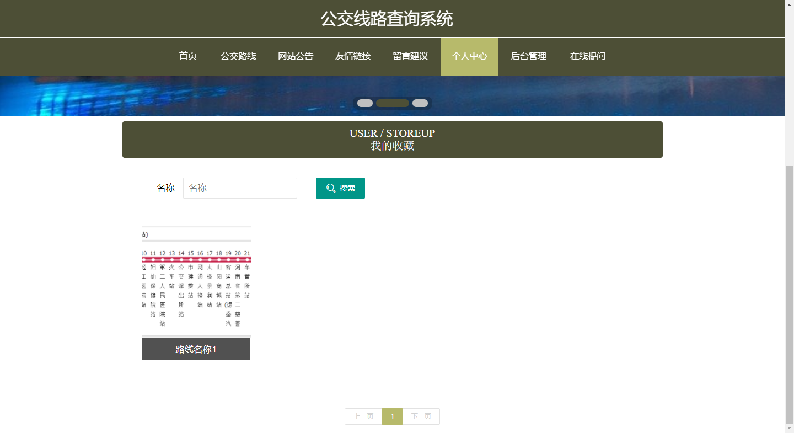

**项目简介：**  
本项目基于主流的前后端分离架构，采用 **SpringBoot + Vue 技术栈**，配套 **MySQL 数据库**，适用于毕业设计与课题实训开发。  
本人已整理了超 **4000 多套毕业设计源码+论文+开题报告+PPT...**，涵盖 **Java、SpringBoot、Vue、SSM、uni-app 小程序、PHP、Android** 等方向，支持功能修改定制与论文服务。  
**团队提供以下服务：**  
- 项目代码修改与调试  
- 数据库配置与远程协助  
- 论文定制与修改  
**获取更多的4000多套源码或SQL文件请联系：**  
- QQ：3906443360 微信：BesheHelp

# springboot161基于springboot的公交线路查询系统

## 第4章 系统设计

4.1 系统设计的原则

在系统设计过程中，也需要遵循相应的设计原则，这些设计原则可以帮助设计者在短时间内设计出符合设计规范的设计方案。设计原则主要有可靠性，安全性，可定制化，可扩展性，可维护性，可升级性以及客户体验等原则。下面就对这些原则进行简要阐述。

可靠性：一个软件是否可靠决定了其是否被用户使用，设计不可靠的软件，用户很容易就遗弃；

安全性：程序软件承担了信息的保存与管理等事务，安全性不足的软件会导致使用者承担巨大的损失；所以系统安全也是需要考虑进入的；

可定制化：市场环境从来都不是一直固定不变，面对客户群体的改变，以及使用环境的改变，市场需求的改变等因素，程序软件也要易于调整以适应各种变化；

可扩展性：程序软件在运行使用期间，也需要及时引进当下的新技术来进行系统优化，主要就是在系统功能层面，系统性能层面上进行相应的扩展，只有这样才能让系统在实际生活中继续占有市场；

可维护性：程序软件的维护需要一定量的资金，不管是排除现有程序错误，还是变更软件的现有需求，都需要在软件技术上投入一定资金，所以易于维护的软件程序就可以降低技术层面的资金消耗；

可升级性：程序软件的投入使用，会面临用户数量增多的情况，用户对软件的使用率也会提升，所以系统面临这种情况，仍然需要通过升级保持性能的合理，这样才能够适应市场；

客户体验：设计出来的程序软件在界面上不能够太复杂，要遵循界面设计的原理设计出简单，方便操作的功能操作界面，让用户易于接受软件，并乐于使用软件提供的功能。

4.2 功能结构设计

在管理员功能模块确定下来的基础上，对管理员各个功能进行设计，确定管理员功能的详细模块。绘制的管理员功能结构见下图。管理员功能有个人中心，用户管理，图书分类管理，图书信息管理，订单管理，系统管理。

图4-2 管理员功能结构图

4.3 数据库设计

与功能结构设计一样，数据库设计也是程序开发不可避免的设计环节，数据库设计最主要的目的就是帮助运行程序存储相应的数据信息。数据库设计包含的内容有数据表结构的设计，也包含了数据库E-R图的设计。

4.3.1 数据库E-R图

在绘制E-R图之前，先要找出数据库的实体，明确各个实体具有的属性，比如用户信息这个实体，它具备的属性包括了用户的姓名属性，用户的密码属性，用户的创建时间属性等，所以明确了用户这个实体，以及用户实体具备的属性之后，就需要根据这些信息绘制用户实体对应的实体属性图了。绘制软件选用当下认可度高，使用范围广，操作便利的微软旗下的Visio工具。

（1）管理员实体属性图通过Visio工具绘制，绘制结果展示如下：

图4-4 管理员实体属性图

（2）用户实体属性图通过Visio工具绘制，绘制结果展示如下：

图4-5 用户实体属性图

（3）网站公告实体属性图通过Visio工具绘制，绘制结果展示如下：

图4-6 网站公告实体属性图

4.3.2 数据库表结构

在进行这部分设计之前，需要明白和掌握数据类型以及各个数据类型的长度范围等知识，因为在一张具体的数据表中，为了方便理解，这里就举个简单的例子。比如用户信息表，这个表格的字段就是用户这个实体具备的属性，这时就需要对字段进行数据类型，以及字段长度的设置，也要设置一个主键来作为用户信息表的唯一标识。这些都是数据库表结构设计需要完成的内容。根据公交线路查询系统的功能设计以及数据库设计要求，展示该系统的数据表结构。

1在线提问表

2用户表

3留言建议表

4网站公告评论表

5公交路线表

6收藏表

7网站公告表

8友情链接表

9管理员表

10公交路线评论表

第5章 系统实现

系统实现这个章节的内容主要还是展示系统的功能界面设计效果，在实现系统基本功能，比如修改，比如添加，比如删除等管理功能的同时，也显示出系统各个功能的界面实现效果，该部分内容一方面与前面提到的系统分析，系统设计的内容相呼应，另一方面也是一个实际成果的展示。

5.1管理员功能实现

5.1.1 用户管理

管理员可以对用户信息进行添加，修改，删除，查询操作。

图5-1 用户管理页面

5.1.2 公交线路管理

管理员可以对公交线路信息进行添加，修改，删除，查询操作。

图5-2 公交线路管理页面

5.1.3 网站公告管理

管理员可以对网站公告信息进行添加，修改，删除，查询操作。

图5-3 网站公告管理页面

5.1.4 友情链接管理

管理员可以对友情链接信息进行添加，修改，删除，查询操作。

图5-4 友情链接管理页面

5.2 用户功能实现

5.2.1 用户注册

用户想要登录系统需要先进行注册，注册账号不能重复。

图5-5 用户注册页面

5.2.2 用户登录

用户注册成功后在登录界面需要输入正确的账号密码才可以登录。

图5-6 用户登录页面

5.2.3 公交线路详情

用户可以查看公交线路查询，可以收藏和评论公交线路。

图5-7 公交线路详情页面

5.2.4 我的收藏

用户收藏过的图书信息可以在我的收藏里查看查询和删除。

图5-8 我的收藏页面

